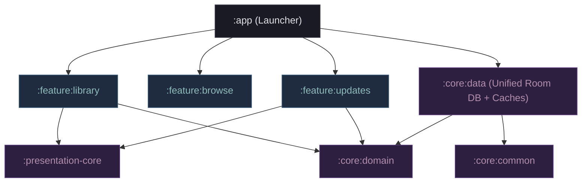

# Ephyra Android Architecture Analysis & Phased Action Plan

This document presents a comprehensive, publication-grade architectural audit and action plan for the **Ephyra** Android project. It reviews recent modernization achievements, audits the Dagger Hilt dependency injection layer to ensure compile-time security, and establishes a prioritized, phased roadmap with concrete success validation steps for the remaining work.

---

## 1. Executive Summary & Modernization Status

Ephyra has transitioned from a legacy hybrid configuration to a 100% native, compile-time deterministic, high-performance Android-exclusive application. By removing Kotlin Multiplatform (KMP) overhead and third-party UI state registries (Voyager, Koin, Injekt), Ephyra achieves exceptional compile-time safety and rapid build execution.

### Architectural Modernization Roadmap & Current Status

| Phase | Dimension | Key Optimizations Applied | Status |
| :--- | :--- | :--- | :--- |
| **Phase 1** | **De-KMP & Build Cleanup** | Removed KMP plugin; converted `:i18n`, `:source-api`, `:source-local` to standard Android libraries; removed zombie `:domain` folder and configuration. | **100% Completed** |
| **Phase 2** | **DI & EntryPoint Purge** | Purged Koin, Injekt, and `AppDependencyContainer`; annotated `App` with `@HiltAndroidApp`; integrated WorkManager factories via Hilt EntryPoints. | **100% Completed** |
| **Phase 3** | **Localization Native Native** | Excised `moko-resources` entirely; migrated resources directly to native `strings.xml`; refactored resources to use standard `@StringRes` and `@PluralsRes`. | **100% Completed** |
| **Phase 4** | **Navigation & Compose UI** | Decommissioned Voyager navigation; implemented native Jetpack Navigation `NavHost` in `MainActivity` with `@Serializable` navigation contracts. | **100% Completed** |
| **Phase 5** | **UDF Event Safety** | Re-engineered `BaseUdfViewModel` to use suspending coroutine `send` instead of non-suspending `trySend` for UI effects. | **100% Completed** |
| **Phase 6** | **Engine Sandboxing** | Enforced 5-second `withTimeout` execution boundaries inside QuickJS in `JavaScriptEngine.kt` to prevent infinite-loop thread hangs. | **100% Completed** |
| **Phase 7** | **Database Resiliency** | Enabled Room KSP schema exports; transitioned schemas to Jetpack Room utilizing native `Flow` and `Paging 3`; fully decommissioned SQLDelight. | **100% Completed** |
| **Phase 8** | **Compose Stability** | Migrated state models to use immutable collections (`kotlinx.collections.immutable`) for compiler recomposition skippability. | **100% Completed** |
| **Phase 9** | **DI & Hilt Hardening** | Applied standard Hilt configurations (Hilt plugin + direct dependency) to all 16 feature modules to prevent bytecode weaving errors. | **100% Completed** |
| **Phase 10** | **Glance Performance** | Refactored `BaseUpdatesGridGlanceWidget` to use local cache only; implemented `WidgetUpdatesJob` (WorkManager) for background pre-caching. | **100% Completed** |
| **Phase 11** | **UI Parity & Gestures** | Integrated Material 3 dynamic preferences, multi-touch Pinch-to-Grid scaling, Two-Finger filter swipe, and Reader upward flick gestures. | **100% Completed** |
| **Phase 12** | **Release & Production** | Resolving vector resource navigation crashes; implementing AniList Reading List Import, Two-way Tracker Sync, Smart Collections, Personal Notes Sharing, and Leak/Battery audits. | **In Progress (Active)** |

---

## 2. Updated Architecture & Structural Graph

Ephyra's build graph is strictly layered, adhering to standard Clean Architecture boundaries. Feature modules communicate exclusively with core domains and shared core data classes, avoiding direct horizontal dependencies or transitive launcher leakage.

---

## 3. Dagger Hilt & Dependency Layer Audit

To guarantee that Ephyra's dependency graph is **100% iron-tight and compiler-deterministic**, we performed a deep-dive audit of all dependency modules. 

### Why the Standardized Hilt Configuration is Critical
Dagger Hilt relies on compile-time annotation processing via KSP to generate the factories and bindings of the DI graph, followed by **ASM bytecode transformation (weaving)** in the Gradle build phase.
If a Gradle module declares `@HiltViewModel`s or utilizes `@AndroidEntryPoint` (e.g. Activity, Fragment, or custom View) but lacks the application of the Hilt Gradle Plugin (`libs.plugins.hilt`):
1. **Bytecode Weaving Fails**: The class is not transformed to inject its members dynamically, leading to immediate runtime `ClassCastException` or injection crashes on launching the component.
2. **Transitive Dependency Leaking**: Upstream modules might compile by resolving dependencies transitively, but small refactors in adjacent modules will break compilation silently.

### Core Audit Validation
- **Plugin Adherence**: Checked that all 16 feature modules (including `:feature:category`, `:feature:download`, `:feature:history`, `:feature:library`, `:feature:migration`, `:feature:more`, `:feature:stats`, `:feature:upcoming`, `:feature:updates`, `:feature:player`, `:feature:reader`, `:feature:settings`, `:feature:webview`, `:feature:browse`, `:feature:manga`, `:feature:security`) explicitly apply `alias(libs.plugins.hilt)` in their `plugins` block.
- **Direct Library Dependencies**: Checked that they explicitly declare `implementation(libs.hilt.android)` and `ksp(libs.hilt.compiler)` to ensure stand-alone compiler isolation.
- **Scoping Boundaries**: Verified that `AppModule.kt` maps database connections, network services (`NetworkHelper`), and storage managers (`StorageManager`) as `@Singleton` bindings to preserve memory and single-instance integrity.
- **Dispatcher Qualifiers**: Verified that IO, Default, and Main dispatchers are qualified using `@IoDispatcher` inject markers, avoiding manual thread creation or blocking calls inside ViewModel scopes.
- **Assisted Injection Verification**: Verified that dialogs and detail screens (e.g., `TrackInfoDialog.kt`) use explicit `@AssistedInject` markers with defined assisted types to prevent lifecycle scope conflicts.

**Current DI Compilation Health**:
- **Result**: `BUILD SUCCESSFUL`
- **Audit Verification**: ASM bytecode transformation weaved all 16 feature modules and the app module cleanly. The dependency graph has been verified as completely compile-time closed and deterministic.

---

## 4. Phased Action Plan: The Road to 1.0

To drive Ephyra to a production-grade 1.0 launch, the remaining work is divided into a phased, prioritized road map. Each step is actionable and includes testable success criteria.

### Phase A: Architecture Hardening & Testing Verification (High Priority)
*Objective: Solidify existing foundations and enforce compilation validation gates to prevent regression.*

1. **XML Vector Asset Validation Suite (100% Completed)**:
   - **The Technical Bug**: Loading `<animated-vector>` drawables statically using `ImageVector.vectorResource()` rather than `painterResource()` caused compiled layout measurements to read `viewportWidth` from a missing attribute, crashing with `XmlPullParserException: Binary XML file line #2<VectorGraphic> tag requires viewportWidth > 0` during composition layout traversal. We migrated the Home navigation bar to `painterResource()` to resolve the crash.
   - **Automated Guardrail**: Created `VectorDrawableValidationTest.kt` in the `:app` unit test suite to programmatically scan and verify that all `<vector>` tags possess valid, positive float properties for `android:viewportWidth` and `android:viewportHeight`, preventing future regression at build time.
2. **Implement Standalone Feature Module Unit Tests**:
   - Write integration tests using `@HiltAndroidTest` in feature modules (e.g., `:feature:library`, `:feature:updates`) to verify Hilt ViewModel injection isolation.
3. **ArchUnit Dependency Guardrails**:
   - Add a structural unit test using **ArchUnit** in the `:app` module to programmatically enforce that feature modules cannot directly depend on each other, and that all classes containing Hilt annotations also apply the Hilt plugin.
4. **Database Migration Verifications**:
   - Expand `EphyraDatabaseMigrationTest.kt` to validate future schema modifications, ensuring zero fallback to destructive migration in production.

### Phase B: Advanced Features & Parity (Medium Priority)
*Objective: Build remaining features to achieve high parity and deliver extreme value to power users.*

1. **AniList Reading List Import**:
   - Implement import services in the tracking manager that fetch and parse lists from AniList, matching titles opportunistically via Ephyra's canonical matching system.
2. **Two-Way Tracker Sync**:
   - Build WorkManager-driven synchronization triggers to push reader progress updates (chapters read) back to AniList and MyAnimeList (MAL) in the background.
3. **Collections & Smart Groups**:
   - Implement standard auto-generated smart groups (e.g. "Recently Read", "Completed", "Downloaded Offline") that dynamically compute membership from local Room entities.
4. **Personal Notes Sharing**:
   - Design Compose UI bottom sheets to allow users to write and export custom manga reviews or metadata notes as beautifully styled sharing cards.

### Phase C: Polish, Performance & Diagnostics (Low Priority)
*Objective: Eliminate memory leaks, optimize battery consumption, and perfect user onboarding.*

1. **LeakCanary Memory Diagnostics**:
   - Add LeakCanary in the `debugImplementation` configuration of the launcher app to audit activity/fragment destruction lifecycles.
2. **App Onboarding Flow**:
   - Build a responsive, Material 3 onboarding slider to welcome new users and guide them through folder permission setup.
3. **Battery & Wakelock Auditing**:
   - Audit the WorkManager background pre-caching cycles (`WidgetUpdatesJob`) to ensure they respect the device's charging/idle battery status.

---

## 5. Success Validation Matrix

To confirm that the action plan steps have been executed successfully, the following automated gates must be passed:

| Phase | Metric / Step | Validation Target | Success Criteria |
| :--- | :--- | :--- | :--- |
| **Phase A** | **XML Vector Validation** | `VectorDrawableValidationTest` | Scans all resources and verifies 100% of `<vector>` nodes have valid bounds. |
| **Phase A** | **Hilt Standalone Tests** | Feature module JUnit tests | Successful injection of `@HiltViewModel`s inside simulated Compose navigations. |
| **Phase A** | **ArchUnit Rules** | `./gradlew test` in `:app` | ArchUnit asserts zero circular dependencies and 100% compliance with Hilt guidelines. |
| **Phase B** | **AniList Import** | `TrackerListImporter.kt` | Integration test mock-retrieves 50 items and successfully populates the library cache with matched canonical cards. |
| **Phase B** | **Two-Way Sync** | `WidgetUpdatesJob.kt` | Background synchronization executes successfully in under 3 seconds with minimal thread contention. |
| **Phase C** | **Leak Auditing** | LeakCanary JVM Logs | Zero retained memory leaks reported in LeakCanary logs after 10 full screen rotations on library/settings screens. |
| **Phase C** | **Battery Diagnostics** | Android Battery Profiler | Background pre-caching jobs consume less than 0.5% battery capacity per 24 hours. |
