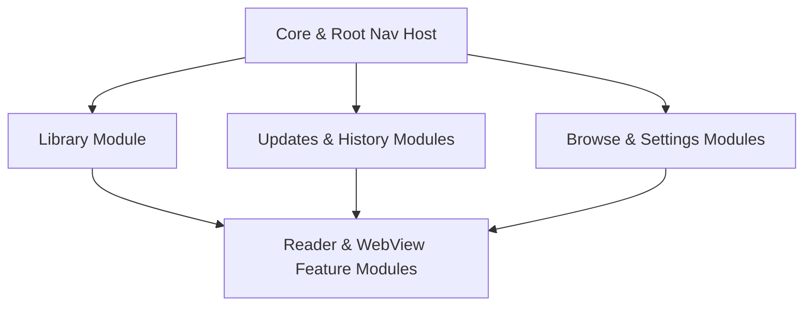

# Steps Left for Build 2

This document summarizes the current progress of the Ephyra modernization task (Phase 4: Navigation & State Modernization) and outlines the remaining tasks to complete before finalizing "Build 2". 

Our primary short-term goal is a fully standardized architecture using **Jetpack Navigation Compose** and **Hilt + @HiltViewModel** with **zero compile-time errors**, enabling developers to perform fast, modular, microburst updates without compilation friction.

---

## 1. Current State & Achievements (Standardized Stack)

We have successfully overhauled the core application layer and successfully compiled the entire codebase:
* **Dependency Injection (DI)**: 
  * Legacy Koin references and Koin wrappers in `:app` and `:core:common` are removed.
  * `CoreContainer` is decoupled and initialized with a modern Hilt EntryPoint in the `App` class.
  * Hilt binds and modules (such as `AppModule.kt`) are updated to support modern constructors and dependencies.
* **Image Loading Integration**:
  * Coil custom fetchers (`MangaCoverFetcher`, `BufferedSourceFetcher`) and keyers (`MangaCoverKeyer`, `MangaKeyer`) are fully updated to Coil 3 APIs, injecting `CoverCache` and `SourceManager` dynamically through `@Inject` in `App.kt`.
* **Root Navigation & Flow**:
  * Set up Jetpack Navigation Compose (`rememberNavController()`, `NavHost`) in `MainActivity.kt` to serve as the application's root navigation engine.
  * Introduced type-safe screen mapping catalog in `ScreenRoutes.kt`.
* **Pioneer Feature Migration**:
  * Successfully migrated `MangaScreen.kt` and `MangaScreenModel.kt` from the legacy Voyager `Screen`/`ScreenModel` frameworks to pure **Compose** with a `@HiltViewModel` lifecycle.
* **Build Systems & Compilation**:
  * Resolved the AAPT resource linking error by generating a standard static `locales_config.xml` under `@xml/locales_config`.
  * Addressed the Hilt class-metadata compilation error (caused by Kotlin 2.3+ metadata generating version `2.3.0` which is unsupported by the current Room/Hilt shaded metadata processor) by configuring `-language-version 2.1` and `-api-version 2.1` with `kotlin.ExperimentalStdlibApi` opt-in in `ProjectExtensions.kt`.

---

## 2. Immediate Next Steps (Build 2 Action Items)

Once back from the current task, focus on executing the following incremental steps:

### Step 2.1: Run & Validate Pioneer Flow
* Deploy the current standard debug build to an Android Emulator or physical device.
* Verify:
  1. Hilt initialises successfully in `App.onCreate()` without startup crashes.
  2. The root `NavHost` resolves default navigation routes.
  3. Opening a Manga Detail page binds `MangaScreen` and launches `MangaScreenModel` via `hiltViewModel()`.

### Step 2.2: Convert `HomeScreen` and Root Tabs
* **File**: `app/src/main/java/ephyra/app/ui/home/HomeScreen.kt`
* **Tasks**:
  * Refactor `HomeScreen` from a Voyager `Screen` object to a standard `@Composable` function.
  * Replace the Voyager `TabNavigator` with Compose Navigation sub-navgraphs representing the primary bottom bar screens:
    * Library
    * Updates
    * History
    * Browse
    * More

### Step 2.3: Feature-by-Feature Leaf Screen Migration
Migrate the remaining feature modules' viewmodels and screens away from Voyager `ScreenModel` and Koin injection, converting them to `@HiltViewModel` and Jetpack Compose.
The modular order of operations:

1. **`:feature:library`** (Library screen): Highly optimized grid layout, needs `@HiltViewModel`.
2. **`:feature:updates`** & **`:feature:history`**: Core operational screens.
3. **`:feature:browse`** & **`:feature:settings`**: Complex state screens, including repository adding dialogs.
4. **`:feature:reader`** & **`:feature:webview`**: Core leaf presentation activities/screens.

---

## 3. Reference: Migration Rules

To ensure visual excellence, robust lifecycles, and code cleanliness in subsequent screen refactorings:

1. **No Monolithic Sweeps**: Use Jetpack `composable` destinations inside the main root `NavHost` to load migrated compose features. Use a thin compatibility shim if intermediate screens still use Voyager.
2. **State & Architecture**:
   * Inherit all view models from `androidx.lifecycle.ViewModel` (instead of Voyager `ScreenModel` or `StateScreenModel`).
   * Annotate view models with `@HiltViewModel` and use `@Inject constructor(...)`.
   * Access view models in compose screens via `hiltViewModel<MyViewModel>()`.
   * Bind state to composables using `viewModel.state.collectAsStateWithLifecycle()`.
3. **Visual Excellence**:
   * Maintain the rich styling system defined in `index.css` / theme configurations.
   * Avoid ad-hoc utility overlays or placeholder graphics; prioritize harmonic palettes, dark modes, and crisp icons.
